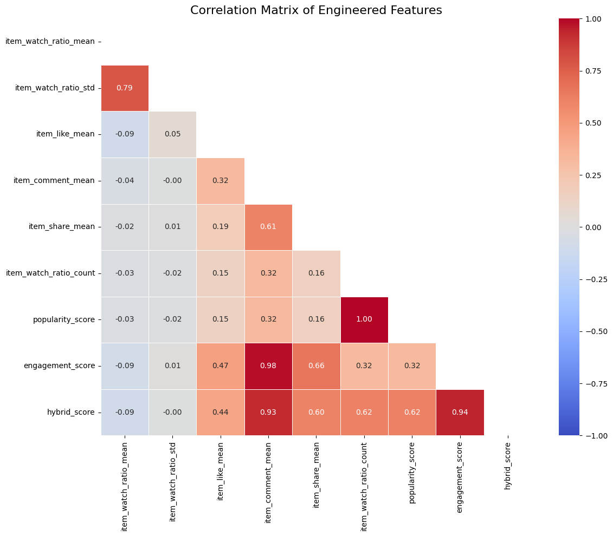
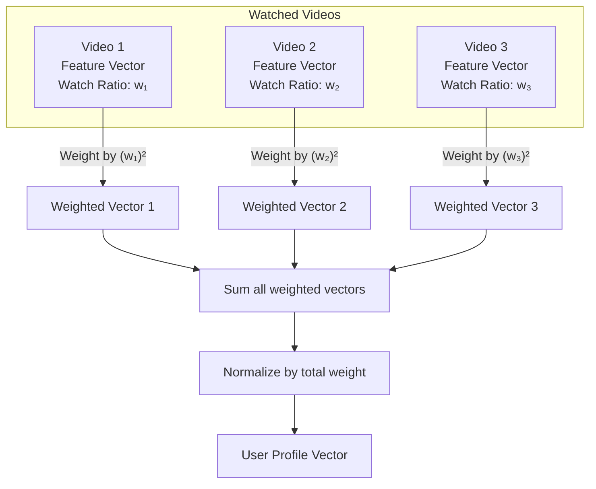

# Short Video Recommender System (KuaiRec dataset)

This project is part of the Recommender Systems course @ EPITA (SCIA - ING2 2025)

**Student**: Armand BLIN (armand.blin@epita.fr)

## **1. Introduction**

This report presents the design, implementation, and evaluation of a scalable content-based recommender system for short videos, using the **KuaiRec** dataset. The objective is to emulate real-world platforms such as TikTok or Kuaishou by leveraging user interaction histories, video metadata, and content features to provide highly personalized recommendations.

---

## **2. Data Preprocessing**

The KuaiRec dataset comprises millions of user-item interactions, enriched with user features, video metadata (tags, categories), and daily engagement statistics. The preprocessing pipeline involves:

- **Merging Data Sources:** User interactions are joined with user features, item categories, and daily video statistics to form unified train/test sets.
- **Cleaning and Normalization:** Missing values are imputed (typically with zeros), and categorical features such as tags are transformed into lists for later vectorization.
- **Feature Selection:** Only relevant columns for modeling are retained.

**Example code snippet:**

```python
# Merge user and video features
merged = interactions.merge(user_features, on="user_id", how="left")
merged = merged.merge(item_categories, on="video_id", how="left")
merged = merged.merge(item_daily_agg, on="video_id", how="left")
merged = merged.fillna(0)
```

**Here is an extract of the resulting DataFrame:**

```
   user_id  video_id  watch_ratio      like_cnt  comment_cnt   share_cnt          feat
0       14       148     0.722103    495.222222    72.603175    9.158730  [11, 28, 19]
1       14       183     1.907377   3343.968254    90.222222   23.746032          [28]
2       14      3649     2.063311   4435.809524    93.650794  133.063492           [9]
3       14      5262     0.566388  21642.365079   463.301587  136.238095          [25]
4       14      8234     0.418364   1396.777778    68.698413    2.873016           [6]
```

---

## **3. Feature Engineering**

### **3.1. Engagement and Popularity Scores**

To capture both the quality and reach of each video, we define two main metrics:

- **Popularity Score (normalized):**

```math
\mathrm{popularity\_score}_i = \frac{N_i - N_{\min}}{N_{\max} - N_{\min} + \epsilon}
```

where $N_i$ is the number of interactions for video $i$.

- **Engagement Score (weighted sum):**

```math
\mathrm{engagement\_score}_i = w_1 \cdot \overline{\mathrm{watch\_ratio}}_i + w_2 \cdot \sigma_{\mathrm{watch\_ratio},i} + w_3 \cdot \overline{\mathrm{like}}_i + w_4 \cdot \overline{\mathrm{comment}}_i + w_5 \cdot \overline{\mathrm{share}}_i
```

with empirically chosen weights, e.g., $w_1 = 0.3,\, w_2 = 0.1,\, w_3 = 0.25,\, w_4 = 0.15,\, w_5 = 0.2$.

- **Hybrid Score:**

```math
\mathrm{hybrid\_score}_i = 0.7 \cdot \mathrm{engagement\_score}_i + 0.3 \cdot \mathrm{popularity\_score}_i
```

**Example code snippet:**

```python
w1, w2, w3, w4, w5 = 0.30, 0.10, 0.25, 0.15, 0.20
item_agg["engagement_score"] = (
    w1 * item_agg["watch_ratio_mean"]
    + w2 * (item_agg["watch_ratio_std"] + 0.01)
    + w3 * item_agg["like_cnt_mean"]
    + w4 * item_agg["comment_cnt_mean"]
    + w5 * item_agg["share_cnt_mean"]
)
```

### **3.2. Tag Vectorization and Feature Weighting**

Tags are vectorized using multi-label binarization. Feature weighting is applied to emphasize the importance of certain features:

```math
\mathrm{feature\_weights} =
\begin{cases}
3.0 & \text{for } \mathrm{engagement\_score} \\
3.0 & \text{for } \mathrm{hybrid\_score} \\
2.0 & \text{for } \mathrm{popularity\_score} \\
0.5 & \text{for } \mathrm{tags}
\end{cases}
```

**Example code snippet:**

```python
FEATURE_WEIGHTS = {
    "engagement_score": 3.0,
    "hybrid_score": 3.0,
    "popularity_score": 2.0,
    "tags": 0.5,
}
```

**Illustration:**

_Correlation matrix showing relationships between different engagement features used in the recommendation system._

**Extract of the resulting user-item matrix**:

```
video_id     5066      10069     1037      8145      1507      951       8769      1623      8770      5274
user_id
5733      0.000000  0.902517  0.626739  0.199476  0.769168  0.749175  1.025754  0.773419  0.630872  0.621210
2735      0.516385  1.009978  0.540784  0.283567  0.658836  0.750356  5.349795  0.978329  0.729884  1.483387
5412      0.384035  0.799770  0.616922  0.197489  0.650213  0.567549  1.268997  0.828976  0.785640  1.470484
816       0.467890  0.923289  0.435121  0.165942  0.617650  0.627767  0.960167  0.961888  0.889826  1.058387
6565      0.470521  0.921413  0.568514  0.175551  0.735345  0.872816  0.654450  0.883692  1.077907  1.038548
6753      0.457426  0.902682  0.668725  0.143339  0.728385  0.747508  1.089571  1.202030  0.699302  0.903871
703       0.443009  0.845762  0.441325  0.216748  0.568425  0.709159  0.740201  1.213277  0.617965  1.223468
6932      0.579879  1.272318  0.636818  0.250949  0.784394  0.879612  1.015282  1.052393  1.053023  1.362419
6790      0.417822  1.048675  0.451510  0.186500  0.711582  0.685955  2.199151  1.654780  0.717733  1.162742
3509      0.000000  1.572450  0.770437  0.032664  0.551495  0.891456  0.803075  1.602935  0.550000  1.239677
5 rows × 10728 columns
```

---

## **4. User Profile Construction**

Each user profile is computed as a weighted average of the feature vectors of the videos they have watched, with the watch ratio squared to emphasize strong engagement:

```math
\mathbf{u}_j = \frac{\sum_{i \in \mathcal{V}_j} (\mathrm{watch\_ratio}_{i,j})^2 \cdot \mathbf{v}_i}{\sum_{i \in \mathcal{V}_j} (\mathrm{watch\_ratio}_{i,j})^2}
```

where $\mathbf{v}_i$ is the feature vector for video $i$, and $\mathcal{V}_j$ is the set of videos watched by user $j$.

**Example code snippet:**

```python
weights = np.power(group["watch_ratio"].values, 2)
user_profile = np.average(video_vectors, axis=0, weights=valid_weights)
```

**Illustration:**
_Diagram showing how a user profile is built from watched videos and their engagement levels._

<center>



</center>

---

## **5. Recommendation Algorithm**

The system computes the cosine similarity between the user profile and all candidate videos:

```math
\mathrm{sim}(\mathbf{u}_j, \mathbf{v}_i) = \frac{\mathbf{u}_j \cdot \mathbf{v}_i}{\|\mathbf{u}_j\| \cdot \|\mathbf{v}_i\|}
```

Videos are ranked by similarity, and the top-N items are recommended, excluding those already watched. An optional diversity factor can be applied to introduce more varied recommendations.

**Illustration:**
_Flowchart of the recommendation process._

<center>


</center>

---

## **6. Evaluation Protocol**

The evaluation uses standard metrics at various $k$ values:

- **Precision@k:**

```math
\mathrm{Precision@k} = \frac{|\{\mathrm{Recommended} \cap \mathrm{Relevant}\}_{@k}|}{k}
```

- **Recall@k:**

```math
\mathrm{Recall@k} = \frac{|\{\mathrm{Recommended} \cap \mathrm{Relevant}\}_{@k}|}{|\{\mathrm{Relevant}\}|}
```

- **MAP@k (Mean Average Precision):**

```math
\mathrm{MAP@k} = \frac{1}{|U|} \sum_{u \in U} \frac{1}{\min(k, |\mathrm{Rel}_u|)} \sum_{i=1}^k P_u(i) \cdot \mathrm{rel}_u(i)
```

- **NDCG@k (Normalized Discounted Cumulative Gain):**

```math
\mathrm{NDCG@k} = \frac{\mathrm{DCG@k}}{\mathrm{IDCG@k}}, \quad \mathrm{DCG@k} = \sum_{i=1}^k \frac{\mathrm{rel}_i}{\log_2(i+1)}
```

**Example code snippet:**

```python
def precision_at_k(recommended, relevant, k):
    return len([item for item in recommended[:k] if item in relevant]) / k

def recall_at_k(recommended, relevant, k):
    return len([item for item in recommended[:k] if item in relevant]) / len(relevant)

def ndcg_at_k(recommended, relevant, k):
    dcg = sum(1.0 / np.log2(i + 2) for i, item in enumerate(recommended[:k]) if item in relevant)
    idcg = sum(1.0 / np.log2(i + 2) for i in range(min(len(relevant), k)))
    return dcg / idcg if idcg > 0 else 0.0
```

---

## **7. Experimental Results**

The following table summarizes the system's performance at different $k$ values:

| k    | Precision | Recall  | MAP   | NDCG  |
| :--- | :-------- | :------ | :---- | :---- |
| 1    | 0.511     | 0.00021 | 0.511 | 0.511 |
| 3    | 0.519     | 0.00065 | 0.449 | 0.517 |
| 5    | 0.522     | 0.00109 | 0.420 | 0.519 |
| 10   | 0.522     | 0.00218 | 0.388 | 0.520 |
| 5000 | 0.312     | 0.645   | 0.417 | 0.615 |

**Interpretation:**

- **Precision** is highest for small $k$, indicating that the very top recommendations are highly relevant.
- **Recall** increases with $k$, as expected, since more relevant items are included in larger recommendation lists.
- **MAP** and **NDCG** confirm good ranking quality, especially for the top results.
- **Coverage** is 100% for all test users.

**Illustration:**

_This figure shows how Precision, Recall, MAP, and NDCG evolve with $k$._

---

## **7.1. Pipeline Execution Log**

Below is the execution log from the recommendation pipeline, showing the processing steps and timing:

```bash
2025-05-15 10:41:20,978 - main-pipeline - INFO - Starting recommendation pipeline...
2025-05-15 10:41:20,979 - main-pipeline - INFO - Training model and generating top-1000 recommendations...
2025-05-15 10:43:42,762 - src.recommenders.content_based_recommender - INFO - Loaded train data with 12530806 interactions
2025-05-15 10:44:12,017 - src.recommenders.content_based_recommender - INFO - Loaded test data with 4676570 interactions
2025-05-15 10:44:12,038 - src.recommenders.content_based_recommender - INFO - Loaded item features with 10728 items
2025-05-15 10:44:12,109 - src.recommenders.content_based_recommender - INFO - Loaded item categories with 10728 items
2025-05-15 10:44:12,127 - src.recommenders.content_based_recommender - INFO - Created complete video features with 10728 items
2025-05-15 10:44:12,177 - src.models.content_model - INFO - Building content-based recommender...
2025-05-15 10:45:07,259 - src.models.content_model - INFO - Content-based model built with 10728 videos and 7176 users
2025-05-15 10:45:08,058 - src.recommenders.content_based_recommender - INFO - Generating recommendations for 1411 users in test set
2025-05-15 10:45:08,654 - src.recommenders.content_based_recommender - INFO - Processed 100/1411 users
2025-05-15 10:45:09,167 - src.recommenders.content_based_recommender - INFO - Processed 200/1411 users
...
2025-05-15 10:45:14,540 - src.recommenders.content_based_recommender - INFO - Processed 1300/1411 users
2025-05-15 10:45:15,023 - src.recommenders.content_based_recommender - INFO - Processed 1400/1411 users
2025-05-15 10:45:17,736 - src.recommenders.content_based_recommender - INFO - Saved 1411000 recommendations to data/results/content_based_top1000_recommendations.csv
2025-05-15 10:45:17,750 - src.recommenders.content_based_recommender - INFO - Average recommendations per user: 1000.00
2025-05-15 10:45:17,750 - src.recommenders.content_based_recommender - INFO - Min recommendations per user: 1000
2025-05-15 10:45:17,750 - src.recommenders.content_based_recommender - INFO - Recommendation coverage: 1411/1411 users (100.00%)
2025-05-15 10:45:19,488 - main-pipeline - INFO - Evaluating model with k=[10, 50, 100, 500, 1000], threshold=0.5...
2025-05-15 10:46:47,899 - main-pipeline - INFO - Starting recommendation pipeline...
2025-05-15 10:46:47,900 - main-pipeline - INFO - Training model and generating top-1000 recommendations...
2025-05-15 10:47:02,788 - main-pipeline - INFO - Starting recommendation pipeline...
2025-05-15 10:47:02,788 - main-pipeline - INFO - Evaluating model with k=[10, 50, 100, 500, 1000], threshold=0.5...
2025-05-15 10:48:02,566 - main-pipeline - INFO - Pipeline completed in 59.78 seconds.
```

---

## **8. Conclusion**

This content-based recommender system leverages a scientifically justified feature engineering and weighting strategy, resulting in high-quality, scalable recommendations. The approach is modular and reproducible, and can be extended with hybrid or sequence-aware models for further improvements.
