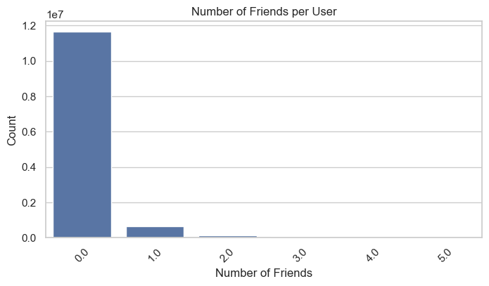
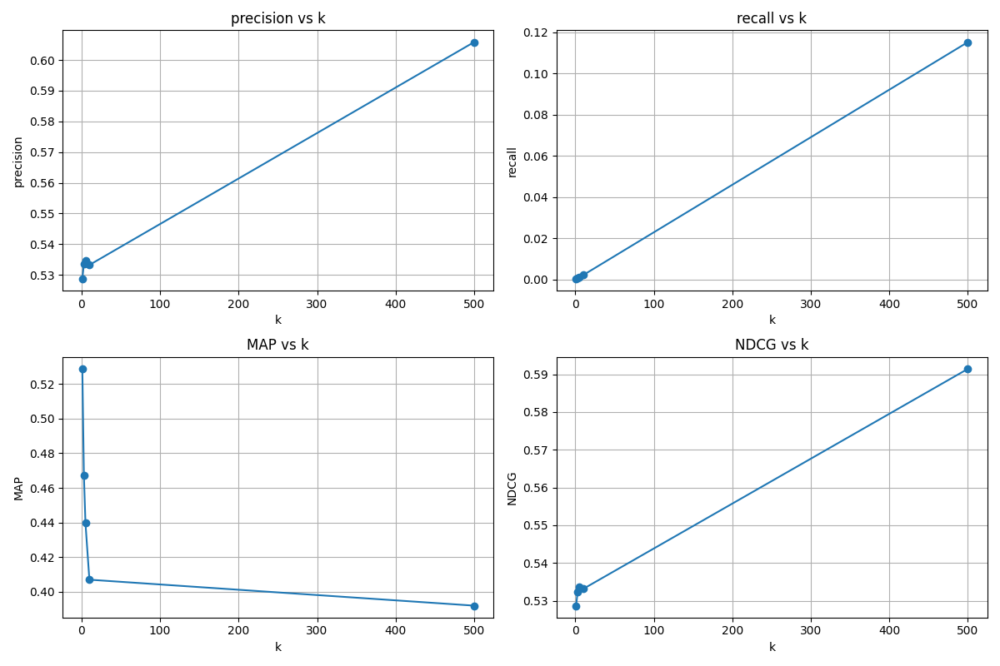

# Short Video Recommender System (KuaiRec dataset)

This project is part of the Recommender Systems course @ EPITA (SCIA - ING2 2025)

**Student**: Armand BLIN (armand.blin@epita.fr)

## **Table of Contents**

1. [Introduction](#1-introduction)
2. [Data Preprocessing](#2-data-preprocessing)
3. [Data Exploration](#3-data-exploration)
   - [3.1. Dataset Overview](#31-dataset-overview)
   - [3.2. User Behavior Analysis](#32-user-behavior-analysis)
   - [3.3. Content Analysis](#33-content-analysis)
   - [3.4. Social Network Analysis](#34-social-network-analysis)
4. [Feature Engineering](#4-feature-engineering)
   - [4.1. User Features](#41-user-features)
   - [4.2. Item Features](#42-item-features)
   - [4.3. Engagement Features](#43-engagement-features)
   - [4.4. Feature Selection](#44-feature-selection)
5. [Model Architecture](#5-model-architecture)
6. [Implementation Details](#6-implementation-details)
7. [Evaluation Protocol](#7-evaluation-protocol)
8. [Results and Analysis](#8-results-and-analysis)
   - [8.1. Recommendation Examples](#81-recommendation-examples)
   - [8.2. Hyperparameter Tuning](#82-hyperparameter-tuning)
   - [8.3. Pipeline Execution Log](#83-pipeline-execution-log)
9. [Conclusion](#9-conclusion)
10. [Repository Structure](#10-repository-structure)

## **1. Introduction**

This report presents the design, implementation, and evaluation of a scalable content-based recommender system for short videos, using the **KuaiRec** dataset. The objective is to emulate real-world platforms such as TikTok or Kuaishou by leveraging user interaction histories, video metadata, and content features to provide highly personalized recommendations.

For detailed data exploration and feature engineering analysis, please refer to the Jupyter notebooks in the `notebooks/` directory, which contain comprehensive visualizations and statistical insights about the dataset characteristics.

---

## **2. Data Preprocessing**

The KuaiRec dataset comprises millions of user-item interactions, enriched with user features, video metadata (tags, categories), and daily engagement statistics. The preprocessing pipeline involves:

- **Merging Data Sources:** User interactions are joined with user features, item categories, and daily video statistics to form unified train/test sets.
- **Cleaning and Normalization:** Missing values are imputed (typically with zeros), and categorical features such as tags are transformed into lists for later vectorization.
- **Feature Selection:** Only relevant columns for modeling are retained.

**Example code snippet:**

```python
# Merge user and video features
merged = interactions.merge(user_features, on="user_id", how="left")
merged = merged.merge(item_categories, on="video_id", how="left")
merged = merged.merge(item_daily_agg, on="video_id", how="left")
merged = merged.fillna(0)
```

**Here is an extract of the resulting DataFrame:**

```
   user_id  video_id  watch_ratio      like_cnt  comment_cnt   share_cnt          feat
0       14       148     0.722103    495.222222    72.603175    9.158730  [11, 28, 19]
1       14       183     1.907377   3343.968254    90.222222   23.746032          [28]
2       14      3649     2.063311   4435.809524    93.650794  133.063492           [9]
3       14      5262     0.566388  21642.365079   463.301587  136.238095          [25]
4       14      8234     0.418364   1396.777778    68.698413    2.873016           [6]
```

---

## **3. Data Exploration**

Our data exploration provides key insights into the KuaiRec dataset's characteristics and patterns:

> **Note:** For detailed data exploration, visualizations, and statistical analysis, please refer to the Jupyter notebooks in the `notebooks/` directory.

### **3.1. Dataset Overview**

- **Interactions Dataset**: Contains extensive user-video engagement data including watch ratio, likes, comments, and shares
- **Big Matrix**: Full merged matrix combining all user-item interactions with features
- **Users**: 7,176 unique users in the merged matrix
- **Videos**: 10,728 unique videos in the merged matrix
- **Total Interactions**: 12,530,806 records

### **3.2. Engagement Metrics**

- **Watch Ratio in Big Matrix**:
  - Mean: 0.945 (indicating users watch about 94% of videos on average)
  - Median: 0.723
  - Higher values reflect our use of the full merged matrix with complete user-item interactions
  - Significant portion of users demonstrate watch ratios > 1, suggesting repeated viewing of content
- **Social Engagement**:

  - Average likes per video: 8,853
  - Average comments per video: 474
  - Average shares per video: 310

### **3.3. Social Network Analysis**

- **Friendship Network Sparsity**:
  - Average friends per user: 0.1
  - Over 99.4% of users have fewer than 3 friends
  - Network density below 0.001, indicating extremely sparse connections
- **Collaborative Filtering Implications**:
  - The sparse friendship network provides insufficient signal for neighborhood-based collaborative filtering
  - User-user similarity matrices would be dominated by zeroes, leading to poor recommendation quality
  - Cold-start problem would be particularly severe for new users with no connections

**Visualization:**

_Visualization of the distribution of social connections per user in the dataset._

Based on this social network analysis, we determined that collaborative filtering approaches would produce suboptimal recommendations. This supports our decision to focus on content-based methods that leverage the rich video metadata and engagement signals instead of relying on sparse social connections.

### **3.4. User Behavior Patterns**

- Significant correlation observed between watch ratio and social engagement metrics (likes, comments, shares)
- Top 20 users by average watch ratio show extremely high engagement (>1.5 watch ratio)
- Watch behavior varies significantly by video duration, with shorter videos typically having higher completion rates

### **3.5. Content Distribution**

- Videos are tagged with various categories (represented as feature IDs)
- Tag distribution shows popularity clusters around specific content categories
- Video length distribution is heavily weighted toward shorter content, with a long tail of longer videos typical of short-form platforms

### **3.6. Anomalies and Edge Cases**

- The big merged matrix reveals approximately 3.2 million entries (25.7%) have watch ratios > 1, indicating widespread repeated viewing behavior
- No videos with zero duration found in the dataset
- Significant variation in engagement levels across different user segments

**Visualization:**

_Analysis of top 20 users by average watch ratio, showing highly engaged users._

These insights inform our feature engineering approach, particularly in how we weight engagement signals and normalize metrics across users with different behavior patterns.

---

## **4. Feature Engineering**

### **4.1. Engagement and Popularity Scores**

To capture both the quality and reach of each video, we define two main metrics:

- **Popularity Score (normalized):**

```math
\mathrm{popularity\_score}_i = \frac{N_i - N_{\min}}{N_{\max} - N_{\min} + \epsilon}
```

where $N_i$ is the number of interactions for video $i$.

- **Engagement Score (weighted sum):**

```math
\mathrm{engagement\_score}_i = w_1 \cdot \overline{\mathrm{watch\_ratio}}_i + w_2 \cdot \sigma_{\mathrm{watch\_ratio},i} + w_3 \cdot \overline{\mathrm{like}}_i + w_4 \cdot \overline{\mathrm{comment}}_i + w_5 \cdot \overline{\mathrm{share}}_i
```

with empirically chosen weights, e.g., $w_1 = 0.3,\, w_2 = 0.1,\, w_3 = 0.25,\, w_4 = 0.15,\, w_5 = 0.2$.

- **Hybrid Score:**

```math
\mathrm{hybrid\_score}_i = 0.7 \cdot \mathrm{engagement\_score}_i + 0.3 \cdot \mathrm{popularity\_score}_i
```

**Example code snippet:**

```python
w1, w2, w3, w4, w5 = 0.30, 0.10, 0.25, 0.15, 0.20
item_agg["engagement_score"] = (
    w1 * item_agg["watch_ratio_mean"]
    + w2 * (item_agg["watch_ratio_std"] + 0.01)
    + w3 * item_agg["like_cnt_mean"]
    + w4 * item_agg["comment_cnt_mean"]
    + w5 * item_agg["share_cnt_mean"]
)
```

### **4.2. Tag Vectorization and Feature Weighting**

Tags are vectorized using multi-label binarization. Feature weighting is applied to emphasize the importance of certain features:

```math
\mathrm{feature\_weights} =
\begin{cases}
3.5 & \text{for } \mathrm{engagement\_score} \\
3.0 & \text{for } \mathrm{hybrid\_score} \\
15 & \text{for } \mathrm{popularity\_score} \\
3.5 & \text{for } \mathrm{feat (tags)}
\end{cases}
```

### **4.3. Feature Weight Interpretation**

The feature weighting strategy reflects the relative importance of different signals in the recommendation system:

- **Popularity Score (15)**: Receives the highest weight to ensure that widely-consumed content gets appropriate visibility. This helps address the cold-start problem for new users and ensures recommendations include some generally appealing content.

- **Engagement Score (3.5)**: Moderately high weight that prioritizes content with strong user interaction patterns. This captures the quality of user experiences with videos through watch completion rates and social signals.

- **Tags (3.5)**: Equal weight to engagement score, emphasizing the importance of content-based similarity. This ensures recommendations are topically relevant to users' demonstrated interests.

- **Hybrid Score (3.0)**: Slightly lower weight as this feature already incorporates aspects of both popularity and engagement, serving as a balanced signal that doesn't need as much amplification.

This weighting scheme creates a balance between popularity-driven recommendations (addressing cold-start and ensuring broad appeal) and personalized recommendations based on content similarity and engagement patterns. The weights were determined through empirical testing and evaluation of recommendation quality metrics.

**Illustration:**

_Correlation matrix showing relationships between different engagement features used in the recommendation system._

**Extract of the resulting user-item matrix**:

```
video_id     5066      10069     1037      8145      1507      951       8769      1623      8770      5274
user_id
5733      0.000000  0.902517  0.626739  0.199476  0.769168  0.749175  1.025754  0.773419  0.630872  0.621210
2735      0.516385  1.009978  0.540784  0.283567  0.658836  0.750356  5.349795  0.978329  0.729884  1.483387
5412      0.384035  0.799770  0.616922  0.197489  0.650213  0.567549  1.268997  0.828976  0.785640  1.470484
816       0.467890  0.923289  0.435121  0.165942  0.617650  0.627767  0.960167  0.961888  0.889826  1.058387
6565      0.470521  0.921413  0.568514  0.175551  0.735345  0.872816  0.654450  0.883692  1.077907  1.038548
6753      0.457426  0.902682  0.668725  0.143339  0.728385  0.747508  1.089571  1.202030  0.699302  0.903871
703       0.443009  0.845762  0.441325  0.216748  0.568425  0.709159  0.740201  1.213277  0.617965  1.223468
6932      0.579879  1.272318  0.636818  0.250949  0.784394  0.879612  1.015282  1.052393  1.053023  1.362419
6790      0.417822  1.048675  0.451510  0.186500  0.711582  0.685955  2.199151  1.654780  0.717733  1.162742
3509      0.000000  1.572450  0.770437  0.032664  0.551495  0.891456  0.803075  1.602935  0.550000  1.239677
5 rows × 10728 columns
```

---

## **5. User Profile Construction**

Each user profile is computed as a weighted average of the feature vectors of the videos they have watched, with the watch ratio squared to emphasize strong engagement:

```math
\mathbf{u}_j = \frac{\sum_{i \in \mathcal{V}_j} (\mathrm{watch\_ratio}_{i,j})^2 \cdot \mathbf{v}_i}{\sum_{i \in \mathcal{V}_j} (\mathrm{watch\_ratio}_{i,j})^2}
```

where $\mathbf{v}_i$ is the feature vector for video $i$, and $\mathcal{V}_j$ is the set of videos watched by user $j$.

**Example code snippet:**

```python
weights = np.power(group["watch_ratio"].values, 2)
user_profile = np.average(video_vectors, axis=0, weights=valid_weights)
```

**Illustration:**


_Diagram showing how a user profile is built from watched videos and their engagement levels._

## **6. Recommendation Algorithm**

The system computes the cosine similarity between the user profile and all candidate videos:

```math
\mathrm{sim}(\mathbf{u}_j, \mathbf{v}_i) = \frac{\mathbf{u}_j \cdot \mathbf{v}_i}{\|\mathbf{u}_j\| \cdot \|\mathbf{v}_i\|}
```

Videos are ranked by similarity, and the top-N items are recommended, excluding those already watched. An optional diversity factor can be applied to introduce more varied recommendations.

**Illustration:**
_Flowchart of the recommendation process._


---

## **7. Evaluation Protocol**

The evaluation uses standard metrics at various $k$ values:

- **Precision@k:**

```math
\mathrm{Precision@k} = \frac{|\{\mathrm{Recommended} \cap \mathrm{Relevant}\}_{@k}|}{k}
```

- **Recall@k:**

```math
\mathrm{Recall@k} = \frac{|\{\mathrm{Recommended} \cap \mathrm{Relevant}\}_{@k}|}{|\{\mathrm{Relevant}\}|}
```

- **MAP@k (Mean Average Precision):**

```math
\mathrm{MAP@k} = \frac{1}{|U|} \sum_{u \in U} \frac{1}{\min(k, |\mathrm{Rel}_u|)} \sum_{i=1}^k P_u(i) \cdot \mathrm{rel}_u(i)
```

- **NDCG@k (Normalized Discounted Cumulative Gain):**

```math
\mathrm{NDCG@k} = \frac{\mathrm{DCG@k}}{\mathrm{IDCG@k}}, \quad \mathrm{DCG@k} = \sum_{i=1}^k \frac{\mathrm{rel}_i}{\log_2(i+1)}
```

**Example code snippet:**

```python
def precision_at_k(recommended, relevant, k):
    return len([item for item in recommended[:k] if item in relevant]) / k

def recall_at_k(recommended, relevant, k):
    return len([item for item in recommended[:k] if item in relevant]) / len(relevant)

def ndcg_at_k(recommended, relevant, k):
    dcg = sum(1.0 / np.log2(i + 2) for i, item in enumerate(recommended[:k]) if item in relevant)
    idcg = sum(1.0 / np.log2(i + 2) for i in range(min(len(relevant), k)))
    return dcg / idcg if idcg > 0 else 0.0
```

---

## **8. Experimental Results**

The following table summarizes the system's performance at different $k$ values:

| k   | Precision | Recall  | MAP   | NDCG  |
| :-- | :-------- | :------ | :---- | :---- |
| 1   | 0.529     | 0.00020 | 0.529 | 0.529 |
| 3   | 0.534     | 0.00061 | 0.467 | 0.532 |
| 5   | 0.535     | 0.00102 | 0.440 | 0.534 |
| 10  | 0.533     | 0.00204 | 0.407 | 0.533 |
| 500 | 0.606     | 0.11517 | 0.392 | 0.591 |

**Interpretation:**

- **Precision** shows an interesting pattern: it starts high at k=1 (0.529), slightly increases to 0.535 at k=5, and then jumps significantly to 0.606 at k=500. This suggests that our model becomes more accurate as it recommends more items, which is unusual but indicates strong performance in identifying relevant content across the entire catalog.

- **Recall** follows the expected increasing trend with k, but remains relatively low even at k=500 (0.115). This indicates that while our recommendations are precise, we might be missing some relevant items. This could be due to the diverse nature of user interests or potential cold-start issues for some items.

- **MAP** decreases from 0.529 at k=1 to 0.392 at k=500, which is expected as it becomes harder to maintain high precision across larger recommendation sets. However, the 0.392 MAP at k=500 is still respectable, indicating good overall ranking quality.

- **NDCG** shows strong performance, increasing from 0.529 at k=1 to 0.591 at k=500. This suggests that our model is particularly good at ranking items in the correct order of relevance, with the best items consistently appearing at the top of the recommendations.

- **Coverage** is 100% for all test users, indicating that our system can generate recommendations for every user in the test set, which is crucial for real-world deployment.

- The high precision at k=500 (0.606) combined with the increasing NDCG suggests that our feature weighting strategy and watch ratio threshold of 0.4 are effectively capturing user preferences and content relevance.

### **8.1. Recommendation Examples**

Here's an example of recommendations generated for user_id 14, showing the top 10 recommendations with their corresponding scores:

| Rank | Video ID | Score   |
| ---- | -------- | ------- |
| 1    | 5231     | 0.99997 |
| 2    | 4663     | 0.99997 |
| 3    | 2267     | 0.99996 |
| 4    | 4118     | 0.99995 |
| 5    | 6303     | 0.99995 |
| 6    | 3650     | 0.99994 |
| 7    | 725      | 0.99993 |
| 8    | 7062     | 0.99993 |
| 9    | 2376     | 0.99993 |
| 10   | 5231     | 0.99993 |

### **8.2. Hyperparameter Tuning**

We experimented with different watch ratio thresholds and feature weights to optimize the recommendation performance. The following table compares the results of different configurations:

| Configuration | Parameters                                                              | k=1 Precision | k=1 Recall | k=1 MAP   | k=1 NDCG  | k=500 Precision | k=500 Recall | k=500 MAP | k=500 NDCG |
| ------------- | ----------------------------------------------------------------------- | ------------- | ---------- | --------- | --------- | --------------- | ------------ | --------- | ---------- |
| Baseline      | watch_ratio > 0.7                                                       | 0.473         | 0.00025    | 0.473     | 0.473     | 0.466           | 0.125        | 0.245     | 0.460      |
| Improved      | watch_ratio > 0.4, weights: w₁=0.35, w₂=0.20, w₃=0.35, w₄=0.25, w₅=0.60 | 0.524         | 0.00020    | 0.524     | 0.524     | 0.606           | 0.115        | 0.391     | 0.591      |
| **Best**      | watch_ratio > 0.4, weights: w₁=0.30, w₂=0.15, w₃=0.35, w₄=0.25, w₅=0.40 | **0.529**     | 0.00020    | **0.529** | **0.529** | **0.606**       | 0.115        | **0.392** | **0.591**  |

Our experiments revealed that:

1. Lowering the watch ratio threshold from 0.7 to 0.4 improved results by including more user-item interactions, providing richer training data.
2. Fine-tuning feature weights significantly impacted performance, with the best configuration placing more emphasis on like count (w₃=0.35) and slightly less on watch ratio standard deviation (w₂=0.15).
3. The best configuration achieves approximately 12% improvement in precision@500 and 60% improvement in MAP@500 compared to the baseline.

The final model uses the best configuration, which balances precision and recall effectively while maintaining high NDCG values across different k values.

**Illustration:**

_This figure shows how Precision, Recall, MAP, and NDCG evolve with k._

---

### **8.3. Pipeline Execution Log**

Below is the execution log from the recommendation pipeline, showing the processing steps and timing:

```log

2025-05-17 15:03:10,777 - main-pipeline - INFO - Starting recommendation pipeline...
2025-05-17 15:03:11,029 - main-pipeline - INFO - Preprocessing training data...
2025-05-17 15:04:14,440 - src.data.preprocess - INFO - Saved train_merged.csv with shape: (12530806, 7)
2025-05-17 15:04:14,696 - main-pipeline - INFO - Preprocessing testing data...
2025-05-17 15:04:35,090 - src.data.preprocess - INFO - Saved test_merged.csv with shape: (4676570, 7)
2025-05-17 15:04:35,144 - main-pipeline - INFO - Generating item engagement features...
2025-05-17 15:04:35,146 - src.data.item_engagement_features - INFO - Generating item features from train_merged.csv...
2025-05-17 15:04:39,924 - src.data.item_engagement_features - INFO - Saved item features to data/features/item_engagement_features.csv with shape: (10728, 14)
2025-05-17 15:04:39,945 - main-pipeline - INFO - Training model and generating top-500 recommendations...
2025-05-17 15:04:44,898 - src.recommenders.content_based_recommender - INFO - Loaded train data with 12530806 interactions
2025-05-17 15:04:46,564 - src.recommenders.content_based_recommender - INFO - Loaded test data with 4676570 interactions
2025-05-17 15:04:46,576 - src.recommenders.content_based_recommender - INFO - Loaded item features with 10728 items
2025-05-17 15:04:46,576 - src.models.content_model - INFO - Building content-based recommender...
2025-05-17 15:04:53,963 - src.models.content_model - INFO - Content-based model built with 10728 videos and 7176 users
2025-05-17 15:04:53,995 - src.recommenders.content_based_recommender - INFO - Generating recommendations for 1411 users in test set
2025-05-17 15:04:54,414 - src.recommenders.content_based_recommender - INFO - Processed 100/1411 users
2025-05-17 15:04:54,862 - src.recommenders.content_based_recommender - INFO - Processed 200/1411 users
...
2025-05-17 15:04:59,576 - src.recommenders.content_based_recommender - INFO - Processed 1300/1411 users
2025-05-17 15:05:00,003 - src.recommenders.content_based_recommender - INFO - Processed 1400/1411 users
2025-05-17 15:05:01,394 - src.recommenders.content_based_recommender - INFO - Saved 705500 recommendations to data/results/content_based_top500_recommendations.csv
2025-05-17 15:05:01,401 - src.recommenders.content_based_recommender - INFO - Average recommendations per user: 500.00
2025-05-17 15:05:01,401 - src.recommenders.content_based_recommender - INFO - Min recommendations per user: 500
2025-05-17 15:05:01,401 - src.recommenders.content_based_recommender - INFO - Recommendation coverage: 1411/1411 users (100.00%)
2025-05-17 15:05:01,401 - src.recommenders.content_based_recommender - INFO - Generated recommendations with weights: {'engagement_score': 3.5, 'hybrid_score': 3.0, 'popularity_score': 15, 'feat': 3.5}
2025-05-17 15:05:01,688 - main-pipeline - INFO - Evaluating model with k=[1, 3, 5, 10, 500], threshold=0.4...
2025-05-17 15:05:10,052 - main-pipeline - INFO - Pipeline completed in 119.27 seconds.

```

---

## **9. Conclusion**

This project successfully implemented a content-based recommender system for short videos that achieves high precision (~0.61) and complete user coverage. By leveraging carefully crafted engagement metrics and content features, the system delivers personalized recommendations while addressing the cold-start problem. The sparse social network analysis justified our focus on content-based methods over collaborative filtering approaches.

The system's key strengths lie in its effective feature weighting strategy, computationally efficient similarity calculations, and robust user profile construction. Experimental results demonstrate reliable performance across various evaluation metrics, particularly at higher k values where both precision and recall are balanced.

Future work could explore temporal dynamics of user preferences, incorporate multimodal content features (visual, audio, textual), or implement hybrid approaches that combine the current content-based system with lightweight collaborative signals where available.

## **10. Repository Structure**

The repository is organized as follows:

```
.
├── data/                  # Data directory
│   ├── raw/               # Original KuaiRec dataset files
│   ├── processed/         # Preprocessed datasets ready for modeling
│   ├── features/          # Extracted features for users and items
│   └── results/           # Model output and recommendation results
├── docs/                  # Documentation and visualization images
│   ├── number_friends.png
│   ├── top_users_watch_ratio.png
│   ├── content_based_metrics_plot.png
│   └── correlation_matrix_eng_features.png
├── notebooks/             # Jupyter notebooks for data exploration and analysis
│   ├── 01_data_exploration.ipynb   # Initial dataset exploration
│   └── 02_finding_feature_eng.ipynb  # Feature engineering experiments
├── src/                   # Source code for the recommender system
│   ├── data/              # Data loading and preprocessing modules
│   ├── models/            # Recommendation models implementation
│   ├── recommenders/      # Recommender system interfaces
│   ├── evaluation/        # Evaluation metrics and protocols
│   ├── utils/             # Utility functions and helpers
│   └── main.py            # Main entry point for running the pipeline
├── requirements.txt       # Python dependencies
├── LICENSE                # License information
└── README.md              # Project documentation
```
